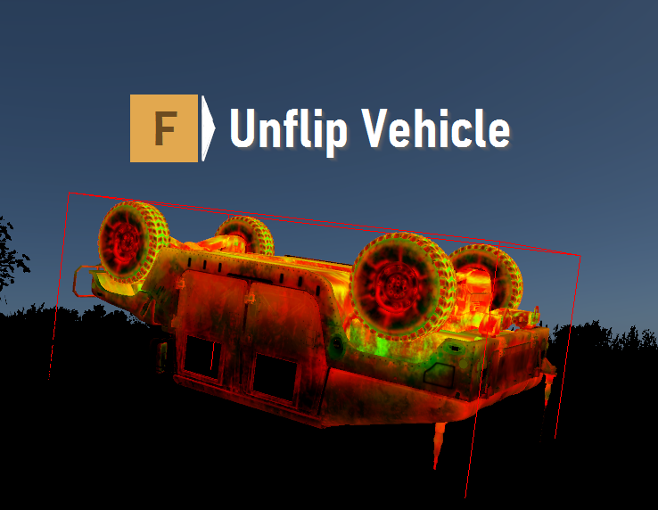
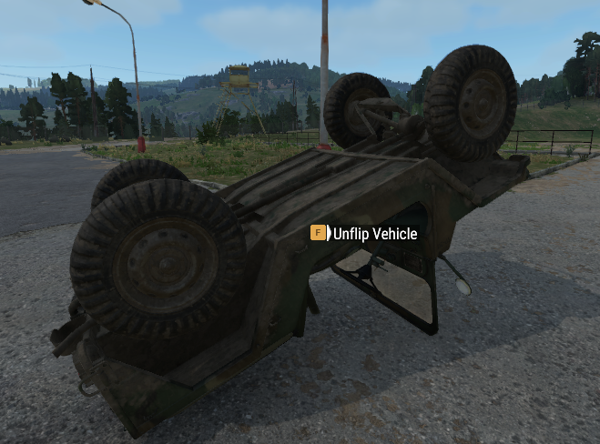

# Project Name
```
Unflip Vehicles
```

## Summary
```
Adds a helpful user action to make flipped over vehicles upright again.
- Works for all vehicles.
```

## Description
```
Being stranded in the middle of no-where with no way of unflipping your whip sucks. This small utility adds the ability to flip over vehicles that have taken a tumble and have ended up topsy-turvy.
```



## Working Dir
```
Z:/reforger-mods/Unflip Vehicles/src
```

## Preview Image
```
Z:/reforger-mods/Unflip Vehicles/unflip-vehicle-0.png
```

## Screenshots
```
Z:/reforger-mods/Unflip Vehicles/unflip-vehicle-0.png
Z:/reforger-mods/Unflip Vehicles/unflip-vehicles-1.png
```

## Category
```
MISC, SYSTEMS, VEHICLES
```

## Tags
```
UNFLIP UTILITIES FIX VEHICLE QOL
```

## Version 
```
0.2.5
```

## Visibility
```
Public
```

